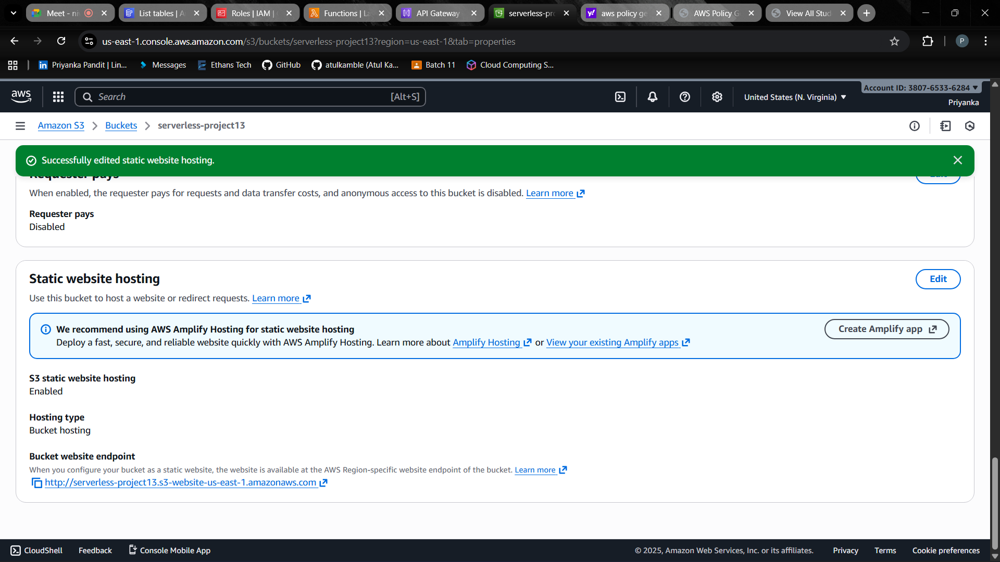
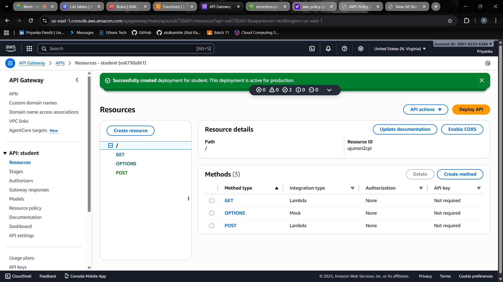
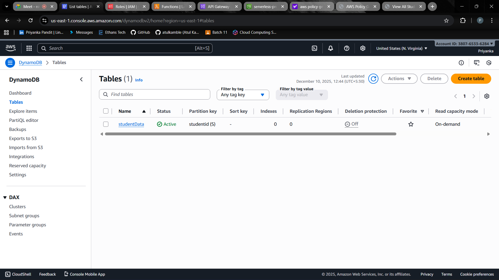
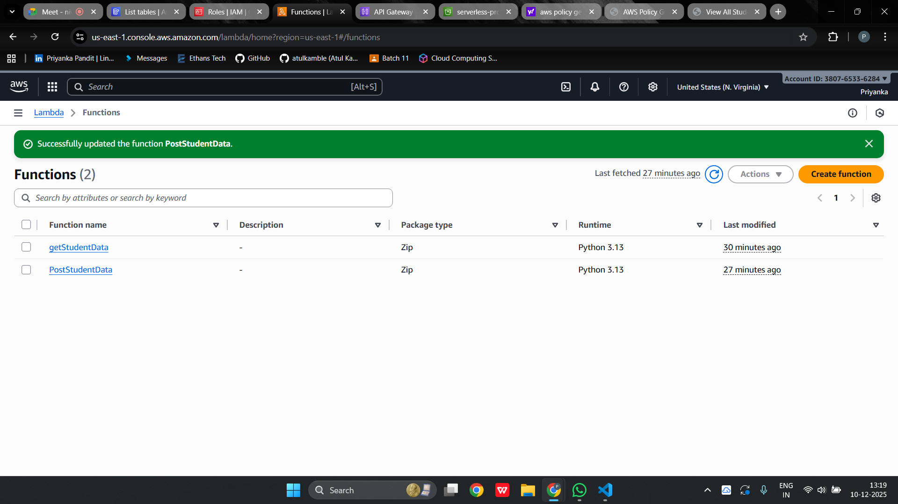

# AWS Serverless Student Management System

This project is a simple **serverless web application** built using AWS services.  
It allows users to **add student records and view all students** using a static website and backend APIs.

The main goal of this project is to **practice and understand AWS serverless architecture** using real AWS services.

---

## Project Overview

This application follows a complete serverless flow:

**S3 (Frontend) → API Gateway → Lambda → DynamoDB**

- Frontend is a **static website** hosted on Amazon S3
- API Gateway exposes **REST APIs**
- AWS Lambda (Python) handles backend logic
- DynamoDB stores student data

---

## Features

- Add new student records
- Fetch and display all student records
- Fully serverless architecture
- Beginner-friendly AWS project
- Uses real AWS services

---

## Technologies Used

- **AWS S3** – Static website hosting  
- **AWS API Gateway** – REST API  
- **AWS Lambda** – Backend logic (Python)  
- **AWS DynamoDB** – NoSQL database  
- **HTML, CSS, JavaScript** – Frontend  

---

## Project Structure

.
├── index.html # Home page
├── add_student.html # Add student form
├── fetch_all_students.html # View all students
├── scripts.js # Frontend API calls
├── Python/
│ ├── getStudents.py # Lambda GET function
│ ├── insertStudentData.py # Lambda POST function
│ ├── BucketPolicy.txt # S3 bucket policy
│ └── s3-CORS Policy.txt # S3 CORS configuration
└── Screen_shots/ # AWS console screenshots

---

## AWS Configuration Details

### 1. DynamoDB

- Table Name: **studentData**
- Partition Key: **studentid**

---

### 2. IAM Role

- IAM role created for AWS Lambda
- Permissions:
  - DynamoDB access (for learning/demo purpose)

---

### 3. Lambda Functions

Two AWS Lambda functions written in Python:

- **getStudentData**
  - Retrieves student records from DynamoDB
  - Triggered using a GET request

- **insertStudentData**
  - Inserts a new student record into DynamoDB
  - Triggered using a POST request

---

### 4. API Gateway

- Created a REST API named **student**
- Configured methods:
  - GET → getStudentData Lambda
  - POST → insertStudentData Lambda
- Enabled CORS for both methods
- Deployed the API to a stage (example: `prod`)

---

### 5. S3 Static Website Hosting

- Created an S3 bucket for frontend hosting
- Uploaded:
  - `index.html`
  - `add_student.html`
  - `fetch_all_students.html`
  - `scripts.js`
- Enabled static website hosting
- Applied bucket policy for public access
- Added CORS configuration

---

## Application Flow

1. User opens the website hosted on S3
2. Frontend JavaScript sends requests to API Gateway
3. API Gateway triggers Lambda functions
4. Lambda interacts with DynamoDB
5. Response is returned to the frontend

---

## Learning Outcomes

This project helped me understand:

- AWS serverless architecture
- Lambda and API Gateway integration
- DynamoDB CRUD operations
- Static website hosting using S3
- IAM roles and permissions
- CORS configuration

---

## Screenshots

Below are the screenshots captured during the implementation of this project.  
All images are stored in the **Screen_shots/** folder.

---

### Website Hosting (S3 Static Website)

---

### Application Output

---

### API Gateway

---

### DynamoDB Table

---

### AWS Lambda Functions

---

## Note

This project was created **for learning and practice purposes**.

---
